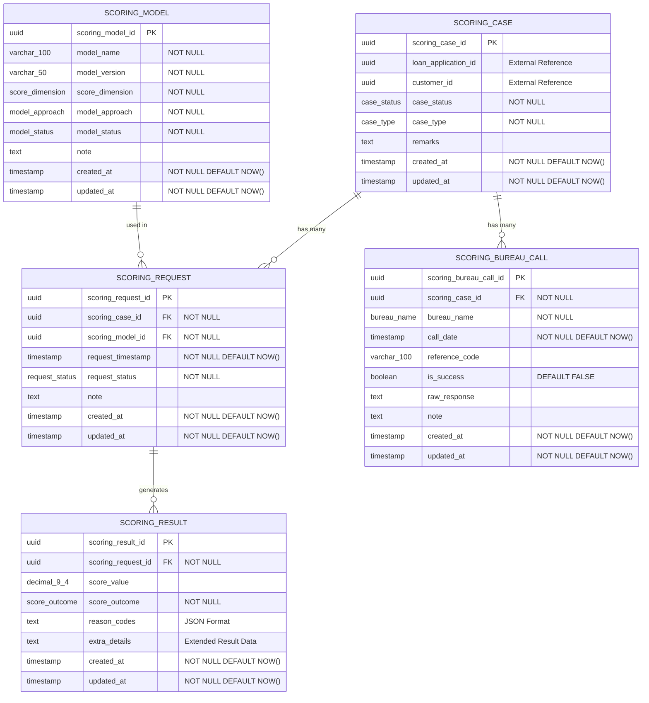

# Core Lending Credit Scoring Service

[](https://opensource.org/licenses/Apache-2.0)
[](https://openjdk.org/projects/jdk/25/)
[](https://spring.io/projects/spring-boot)
[](https://maven.apache.org/)
[](https://www.postgresql.org/)

## Overview

The **Core Lending Credit Scoring Service** is a reactive microservice component of the **Firefly OpenCore Banking Platform**, developed by **Firefly Software Solutions Inc** under the Apache 2.0 license. This service provides comprehensive credit scoring functionality for lending applications, managing the complete lifecycle of credit assessments through sophisticated scoring models, case management, and external bureau integrations.

**Organization Website**: [getfirefly.io](https://getfirefly.io)  
**GitHub Organization**: [firefly-oss](https://github.com/firefly-oss)  
**License**: Apache License 2.0

### Key Features

- **Advanced Credit Scoring Models** - Support for AI, rule-based, hybrid, and statistical approaches
- **Case Management** - Complete lifecycle management of credit scoring cases
- **Reactive Architecture** - Built with Spring WebFlux for high-performance, non-blocking operations
- **Bureau Integration** - Seamless integration with multiple credit bureaus (Equifax, Experian, ASNEF, etc.)
- **Comprehensive Results** - Detailed scoring outcomes with reason codes and explanations
- **Advanced Filtering** - Sophisticated search and pagination capabilities
- **Production Ready** - Built-in monitoring, health checks, and observability

## Entity Relationship Diagram



### Enum Types

The service uses PostgreSQL custom enum types for data integrity:

- **case_status**: `OPEN`, `COMPLETED`, `FAILED`, `CANCELLED`
- **case_type**: `APPLICATION`, `RE_SCORING`, `PORTFOLIO_MONITOR`, `PRE_APPROVAL`
- **bureau_name**: `AXESOR`, `EQUIFAX`, `EXPERIAN`, `ASNEF`, `OTHER`
- **score_dimension**: `FINANCIAL`, `NON_FINANCIAL`, `COMBINED`, `BEHAVIORAL`
- **model_approach**: `AI`, `RULES_BASED`, `HYBRID`, `STATISTICAL`
- **model_status**: `ACTIVE`, `DEPRECATED`, `TESTING`, `DISABLED`
- **request_status**: `COMPLETED`, `FAILED`, `PENDING`, `IN_PROGRESS`, `TIMEOUT`
- **score_outcome**: `APPROVE`, `REJECT`, `MANUAL_REVIEW`, `REFER_TO_SUPERVISOR`

## Architecture

### Module Structure

The service follows a layered architecture with the following modules:

#### 1. **core-lending-credit-scoring-interfaces**
- **Purpose**: API contracts and data transfer objects
- **Contains**: 
  - DTOs for all entities (ScoringCase, ScoringRequest, ScoringResult, ScoringModel, ScoringBureauCall)
  - Enums for business logic (CaseStatus, CaseType, ModelApproach, ModelStatus, ScoreDimension, ScoreOutcome, RequestStatus, BureauName)
  - Validation annotations and constraints

#### 2. **core-lending-credit-scoring-models**
- **Purpose**: Data persistence layer
- **Contains**:
  - R2DBC entities mapped to PostgreSQL tables
  - Reactive repositories extending BaseRepository
  - Database migrations (Flyway)
  - Entity relationship mappings

#### 3. **core-lending-credit-scoring-core**
- **Purpose**: Business logic and service implementations
- **Contains**:
  - Service interfaces and implementations
  - Entity-DTO mappers using MapStruct
  - Business rules and validation logic
  - Transaction management

#### 4. **core-lending-credit-scoring-web**
- **Purpose**: Web layer and application entry point
- **Contains**:
  - REST controllers with reactive endpoints
  - Spring Boot application configuration
  - OpenAPI/Swagger documentation setup
  - Exception handling and validation

#### 5. **core-lending-credit-scoring-sdk**
- **Purpose**: Client SDK and API specifications
- **Contains**:
  - OpenAPI specification files
  - Generated client libraries
  - API documentation resources

### Technology Stack

- **Java 25** - Latest LTS with Virtual Threads support
- **Spring Boot 3.x** - Application framework with reactive support
- **Spring WebFlux** - Reactive web framework for non-blocking I/O
- **R2DBC PostgreSQL** - Reactive database connectivity
- **PostgreSQL** - Primary database for data persistence
- **Flyway** - Database schema migration tool
- **SpringDoc OpenAPI** - API documentation generation
- **Maven** - Build tool and dependency management
- **Spring Boot Actuator** - Production monitoring and health checks
- **MapStruct** - Type-safe bean mapping
- **Jakarta Validation** - Bean validation with custom validators

## Getting Started

### Prerequisites

- **Java 25+** (OpenJDK or Oracle JDK)
- **Maven 3.8+**
- **PostgreSQL 13+**
- **Docker** (optional, for containerized deployment)

### Environment Configuration

Create a `.env` file or set the following environment variables:

```bash
# Database Configuration
DB_HOST=localhost
DB_PORT=5432
DB_NAME=credit_scoring
DB_USERNAME=postgres
DB_PASSWORD=your_secure_password
DB_SSL_MODE=disable

# Server Configuration (Optional)
SERVER_ADDRESS=localhost
SERVER_PORT=8080
```

### Build and Run

#### Local Development

1. **Clone the repository:**
   ```bash
   git clone https://github.com/firefly-oss/core-lending-credit-scoring.git
   cd core-lending-credit-scoring
   ```

2. **Build the project:**
   ```bash
   mvn clean install
   ```

3. **Run the application:**
   ```bash
   mvn spring-boot:run -pl core-lending-credit-scoring-web
   ```

#### Docker Deployment

1. **Build the Docker image:**
   ```bash
   docker build -t firefly/core-lending-credit-scoring .
   ```

2. **Run with Docker:**
   ```bash
   docker run -p 8080:8080 --env-file .env firefly/core-lending-credit-scoring
   ```

## API Documentation

### Endpoints Overview

The service provides a comprehensive REST API organized hierarchically:

```
/api/v1/
├── scoring-cases/                           # Credit scoring cases
│   ├── GET    /                            # List/search cases
│   ├── POST   /                            # Create new case
│   ├── GET    /{caseId}                    # Get case by ID
│   ├── PUT    /{caseId}                    # Update case
│   ├── DELETE /{caseId}                    # Delete case
│   ├── {caseId}/requests/                  # Scoring requests within a case
│   │   ├── GET    /                        # List/search requests
│   │   ├── POST   /                        # Create new request
│   │   ├── GET    /{requestId}             # Get request by ID
│   │   ├── PUT    /{requestId}             # Update request
│   │   ├── DELETE /{requestId}             # Delete request
│   │   └── {requestId}/results/            # Results for specific requests
│   │       ├── GET    /                    # List/search results
│   │       ├── POST   /                    # Create new result
│   │       ├── GET    /{resultId}          # Get result by ID
│   │       ├── PUT    /{resultId}          # Update result
│   │       └── DELETE /{resultId}          # Delete result
│   └── {caseId}/bureau-calls/              # Bureau calls for a case
│       ├── GET    /                        # List/search bureau calls
│       ├── POST   /                        # Create new bureau call
│       ├── GET    /{callId}                # Get bureau call by ID
│       ├── PUT    /{callId}                # Update bureau call
│       └── DELETE /{callId}                # Delete bureau call
└── scoring-models/                         # Credit scoring models
    ├── GET    /                            # List/search models
    ├── POST   /                            # Create new model
    ├── GET    /{modelId}                   # Get model by ID
    ├── PUT    /{modelId}                   # Update model
    └── DELETE /{modelId}                   # Delete model
```

### Key Resources

1. **Scoring Cases** - Main containers for credit scoring operations
   - Manage case lifecycle and status (`OPEN`, `COMPLETED`, `FAILED`, `CANCELLED`)
   - Link to external loan applications and customers via UUIDs
   - Support different case types (`APPLICATION`, `RE_SCORING`, `PORTFOLIO_MONITOR`, `PRE_APPROVAL`)

2. **Scoring Models** - Configurable scoring algorithms
   - Support multiple approaches (`AI`, `RULES_BASED`, `HYBRID`, `STATISTICAL`)
   - Versioned model management with semantic versioning
   - Various score dimensions (`FINANCIAL`, `NON_FINANCIAL`, `COMBINED`, `BEHAVIORAL`)
   - Model status management (`ACTIVE`, `DEPRECATED`, `TESTING`, `DISABLED`)

3. **Scoring Requests** - Individual scoring operations
   - Link cases with specific models
   - Track request status (`COMPLETED`, `FAILED`, `PENDING`, `IN_PROGRESS`, `TIMEOUT`)
   - Support batch and real-time processing

4. **Scoring Results** - Computed scores and outcomes
   - Numerical scores with configurable precision (DECIMAL 9,4)
   - Categorical outcomes (`APPROVE`, `REJECT`, `MANUAL_REVIEW`, `REFER_TO_SUPERVISOR`)
   - Reason codes and detailed explanations in JSON format

5. **Bureau Calls** - External credit bureau integrations
   - Track bureau API calls and responses
   - Support multiple bureau providers (`AXESOR`, `EQUIFAX`, `EXPERIAN`, `ASNEF`, `OTHER`)
   - Audit trail for regulatory compliance with success/failure tracking

### API Documentation Access

When the application is running:

- **Swagger UI**: `http://localhost:8080/swagger-ui.html`
- **OpenAPI Spec**: `http://localhost:8080/v3/api-docs`

### Authentication & Authorization

*Note: This service focuses on core business logic. Authentication and authorization are handled by the API Gateway in the Firefly OpenCore Banking Platform.*

### Request/Response Features

- **Reactive Streams**: All endpoints return `Mono<T>` or `Flux<T>` for non-blocking operations
- **Pagination**: Built-in pagination support with `PaginationResponse<T>`
- **Filtering**: Advanced filtering capabilities using `FilterRequest<T>`
- **Validation**: Comprehensive input validation with Jakarta Validation
- **Idempotency**: Support for idempotent operations via `X-Idempotency-Key` header
- **Error Handling**: Standardized error responses with proper HTTP status codes

## Configuration Profiles

The application supports multiple deployment profiles:

### Development (`dev`)
- Enhanced logging for debugging (`DEBUG` level for Firefly packages)
- Swagger UI enabled
- Database query logging active
- R2DBC query logging enabled

### Testing (`testing`)
- Moderate logging levels (`INFO` for most, `DEBUG` for Firefly)
- API documentation enabled
- Optimized for test execution
- R2DBC query logging disabled for performance

### Production (`prod`)
- Minimal logging for performance (`WARN` for root, `INFO` for Firefly)
- Swagger UI disabled for security
- Health checks and metrics only
- Optimized for production workloads

Activate a profile:
```bash
java -jar target/core-lending-credit-scoring-web.jar --spring.profiles.active=prod
```

## Monitoring & Health Checks

### Health Endpoints

- **Health Check**: `GET /actuator/health`
- **Application Info**: `GET /actuator/info`
- **Prometheus Metrics**: `GET /actuator/prometheus`

### Health Check Response
```json
{
  "status": "UP",
  "components": {
    "db": {
      "status": "UP",
      "details": {
        "database": "PostgreSQL",
        "validationQuery": "isValid()"
      }
    },
    "diskSpace": {
      "status": "UP"
    },
    "livenessState": {
      "status": "UP"
    },
    "readinessState": {
      "status": "UP"
    }
  }
}
```

## Development Guidelines

### Code Organization

- **Package Structure**: Follows domain-driven design principles with clear module separation
- **Naming Conventions**: Clear, descriptive names with consistent patterns
- **API Versioning**: URL path versioning (`/api/v1/`)
- **Error Handling**: Standardized error responses with proper HTTP status codes
- **Reactive Programming**: Consistent use of `Mono<T>` and `Flux<T>` throughout

### Database Conventions

- **Snake Case**: Database columns use snake_case naming
- **UUIDs**: Primary keys use UUID for better distributed system support
- **Timestamps**: All entities include `created_at` and `updated_at`
- **Enums**: Custom PostgreSQL enum types for better data integrity
- **Foreign Keys**: Explicit foreign key constraints for referential integrity

### Testing Strategy

Run the test suite:
```bash
mvn test
```

*Note: Comprehensive test suite includes unit tests, integration tests, and API contract testing.*

## Performance Considerations

- **Reactive Streams**: Non-blocking I/O throughout the stack using Spring WebFlux
- **Virtual Threads**: Java 25 virtual threads enabled for improved concurrency
- **Connection Pooling**: Optimized R2DBC connection pool configuration (5-10 connections)
- **Database Indexing**: Strategic indexes on frequently queried columns
- **Lazy Loading**: Efficient data loading patterns with reactive repositories

## Security Features

- **SQL Injection Prevention**: Parameterized queries and R2DBC protection
- **Audit Logging**: Comprehensive audit trail for all operations via timestamps
- **Health Check Security**: Limited exposure of sensitive information
- **Data Validation**: Input validation at API and service layers using Jakarta Validation
- **Enum Constraints**: Database-level enum constraints prevent invalid data

## Integration Points

This microservice integrates with other Firefly OpenCore Banking Platform components:

- **Core Banking System**: Customer and loan application data via external UUID references
- **API Gateway**: Authentication, rate limiting, and routing
- **Data Analytics Platform**: Scoring model training and validation
- **Credit Bureau APIs**: External credit data providers (Equifax, Experian, ASNEF, etc.)
- **Monitoring Stack**: Prometheus metrics and health check integration

## Contributing

We welcome contributions to the Firefly OpenCore Banking Platform! Please read our contribution guidelines and code of conduct.

### Development Setup

1. Fork the repository from [firefly-oss/core-lending-credit-scoring](https://github.com/firefly-oss/core-lending-credit-scoring)
2. Create a feature branch (`git checkout -b feature/amazing-feature`)
3. Make your changes with appropriate tests
4. Ensure all tests pass (`mvn test`)
5. Submit a pull request

### Code Standards

- Follow Java coding conventions and best practices
- Write comprehensive unit and integration tests
- Update documentation for any API changes
- Use meaningful commit messages
- Ensure reactive programming patterns are maintained

## Support & Contact

- **Website**: [getfirefly.io](https://getfirefly.io)
- **Development Team**: dev@getfirefly.io
- **Issues**: [GitHub Issues](https://github.com/firefly-oss/core-lending-credit-scoring/issues)
- **Documentation**: [Firefly OpenCore Docs](https://docs.getfirefly.io)

## License

This project is licensed under the **Apache License 2.0** - see the [LICENSE](LICENSE) file for details.

---

**Firefly OpenCore Banking Platform** - Building the future of open banking technology.

*Copyright 2024 Firefly Software Solutions Inc. All rights reserved.*
